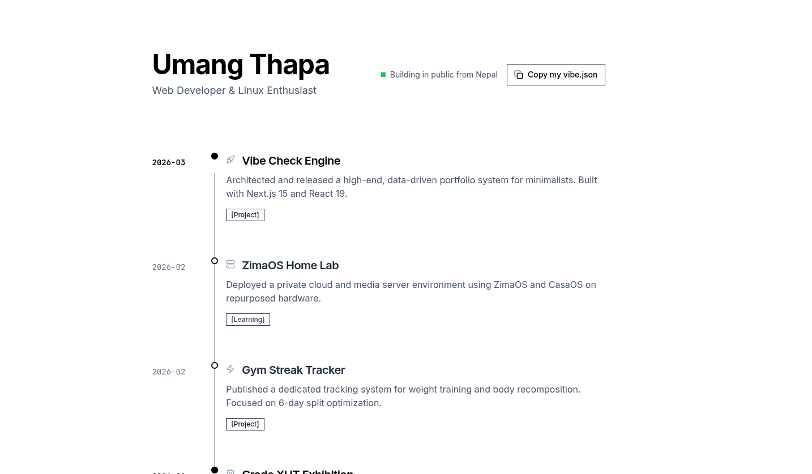
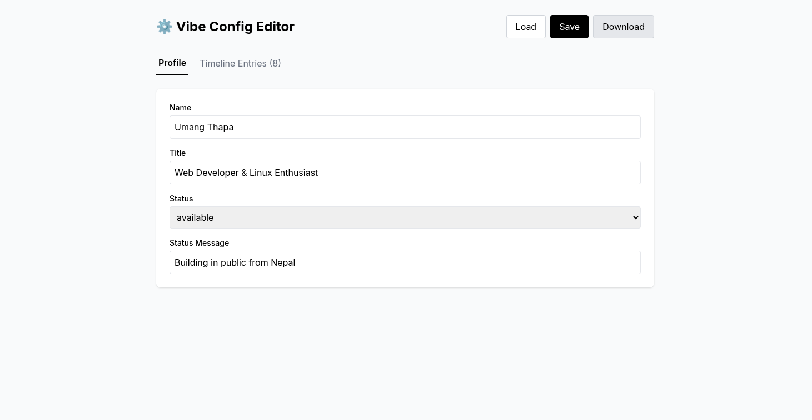

# ◈ Vibe Check

**An architectural, data-driven portfolio engine for the minimalist developer.** Built with **Next.js 15**, **React 19**, and **Framer Motion**.

[](https://vercel.com/new/clone?repository-url=https%3A%2F%2Fgithub.com%2Fumangthapa1%2Fvibe-check)

---

## 01. Philosophy

Standard portfolios are cluttered. **Vibe Check** treats your career, projects, and personal growth like a surgical Git-log history. It separates your **Life Data** (`vibe.json`) from the **Interface**, allowing you to maintain a high-end digital presence with zero design overhead.

## 02. Core Aura

- ♠ **Aggressive Minimalism** — A strict monochrome palette designed for clarity and focus.
- ⚡ **Next.js 15 + React 19** — Leveraging the bleeding edge of the Vercel ecosystem.
- ◓ **Systemic Animations** — Staggered Framer Motion entrances that feel fluid and intentional.
- ⬢ **Git-Log Aesthetic** — A vertical timeline that ditches "cards" for architectural precision.
- 🟢 **Live Status** — Integrated CSS-pulsing availability indicator.
- 📋 **Portable Profile** — One-click "Copy vibe.json" functionality for seamless sharing.

## 03. Quickstart

```bash
# Clone the architecture
git clone https://github.com/umangthapa1/vibe-check.git
cd vibe-check

# Install the ecosystem
npm install

# Initialize development
npm run dev
```

Open [http://localhost:3000](http://localhost:3000) in your browser.

---

## 04. Live Demo

🔗 **Live Website:** https://vibe-check-84g07wo98-umangs-projects-c9068f52.vercel.app

---

## 05. Data Structure

### Timeline View



### Admin Panel



### Features

| Feature | Description |
|---------|-------------|
| **Git-Log Aesthetic** | Vertical timeline with nodes and connecting lines |
| **Live Status** | Pulsing green dot for availability |
| **One-Click Copy** | Copy entire vibe.json to clipboard |
| **Image Support** | Add images to any timeline entry |
| **Auto-Save** | Changes save automatically to vibe.json |
| **Responsive** | Works on mobile and desktop |

### Configuration

You are the architect. Control your entire portfolio from a single source of truth in `public/vibe.json`, or use the built-in admin editor.

### Admin Editor (Easiest)

```bash
npm run dev
```

Then open:
- **http://localhost:3000** — Your portfolio
- **http://localhost:3000/admin** — Config editor

In the admin panel:
- **Load** — Load an existing vibe.json
- **Save** — Save changes to server
- **Download** — Download vibe.json file

### Manual JSON Editing

Edit `public/vibe.json` directly:

```json
{
  "meta": {
    "name": "Your Name",
    "title": "Your Role",
    "status": "available",
    "statusMessage": "Open for collaborations"
  },
  "entries": [
    {
      "id": "001",
      "date": "2026-03",
      "title": "Your Achievement",
      "description": "What you did and why it matters.",
      "category": "Project",
      "icon": "rocket",
      "highlight": true
    }
  ]
}
```

### Data Structure

| Field | Type | Description |
|-------|------|-------------|
| `meta.name` | string | Your name |
| `meta.title` | string | Your role/title |
| `meta.status` | `"available"` \| `"busy"` \| `"unavailable"` | Availability status |
| `meta.statusMessage` | string | Custom status message |
| `entries[].date` | string | Date in YYYY-MM format |
| `entries[].title` | string | Entry title |
| `entries[].description` | string | Detailed description |
| `entries[].category` | `"Project"` \| `"Work"` \| `"Life"` \| `"Learning"` | Category type |
| `entries[].icon` | string | Lucide icon name (rocket, briefcase, star, mic, palette, etc.) |
| `entries[].image` | string | Image URL to display |
| `entries[].highlight` | boolean | Whether to emphasize this entry |

---

## 07. Technical Stack

| Layer | Technology |
|-------|------------|
| **Engine** | Next.js 15 (App Router) |
| **UI Library** | React 19 |
| **Styling** | Tailwind CSS (Grayscale System) |
| **Motion** | Framer Motion |
| **Icons** | Lucide React |
| **Type Safety** | TypeScript 5+ |

### Dependencies

```json
{
  "next": "^15.1.0",
  "react": "^19.0.0",
  "framer-motion": "^11.15.0",
  "lucide-react": "^0.469.0"
}
```

---

## 08. Directory Structure

```
src/
├── app/                      # Next.js 15 App Router
│   ├── globals.css           # Global styles & Tailwind
│   ├── layout.tsx            # Root layout with fonts
│   └── page.tsx              # Homepage
├── components/
│   └── vibe-timeline/        # Timeline component library
│       ├── VibeTimeline.tsx  # Main container
│       ├── TimelineEntry.tsx # Individual entry with animations
│       ├── TimelineHeader.tsx # Header with copy button
│       ├── CategoryBadge.tsx  # Category labels
│       ├── LiveDot.tsx      # Status indicator
│       ├── CopyToast.tsx    # Toast notification
│       └── index.ts         # Barrel exports
├── types/
│   └── vibe.ts              # TypeScript definitions
└── public/
    └── vibe.json            # Your profile data
```

---

## 09. How It Works

### Data Flow
1. `public/vibe.json` is imported directly in [`src/app/page.tsx`](src/app/page.tsx)
2. Data is type-asserted against the `VibeConfig` interface
3. Passed to `<VibeTimeline data={vibeConfig} />`
4. Each entry renders with staggered Framer Motion animations

- **Entrance:** Staggered animations### Animation System
 — each entry delays by `index * 0.1s`
- **Easing:** Custom cubic-bezier `[0.25, 0.46, 0.45, 0.94]`
- **Viewport:** Entries animate when scrolled into view (`whileInView`)
- **Status Dot:** CSS keyframe `pulse-green` animation

### Copy Functionality
The "Copy my vibe.json" button:
1. Serializes the config to formatted JSON
2. Uses `navigator.clipboard.writeText()`
3. Shows toast notification with Framer Motion
4. Auto-resets after 2.5 seconds

---

## 08. Customization

### Adding Entries
Edit `public/vibe.json` and add entries to the `entries` array:

```json
{
  "id": "unique-id",
  "date": "2026-04",
  "title": "New Achievement",
  "description": "Description here",
  "category": "Work",
  "icon": "briefcase",
  "highlight": false
}
```

### Available Icons
`rocket`, `briefcase`, `star`, `mic`, `palette`, `mapPin`, `bookOpen`, `building`, `code`, `coffee`, `heart`, `zap`

### Available Categories
`Project` (dark), `Work` (medium), `Life` (light), `Learning` (subtle)

---

## 09. Build & Deployment

### Development
```bash
npm run dev
```

### Production Build
```bash
npm run build    # Creates optimized build
npm start        # Serve production build
```

### Deployment
Click the **Deploy to Vercel** button at the top, or:

```bash
# Push to GitHub, then:
npx vercel
```

---

## 10. Issues & Solutions

| Issue | Status | Solution |
|-------|--------|----------|
| 404 for favicon.ico |cosmetic | Add `public/favicon.ico` |
| Git push auth failed | pending | Run `git push` manually with credentials |

---

## 11. Credits

Built by **Umang Thapa** | Licensed under MIT

Inspired by Git-log aesthetics and Scandinavian minimalism.
