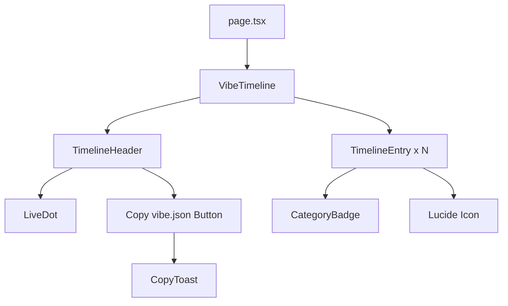

# VibeTimeline — Architecture Plan

## Overview

A premium, Awwwards-quality portfolio timeline component built with Next.js 15, inspired by Git log aesthetics and Scandinavian minimalism. Entirely data-driven via a single `vibe.json` configuration file.

---

## Design System

### Color Palette (Aggressive Monochrome)

| Token         | Hex       | Usage                              |
|---------------|-----------|-------------------------------------|
| `pure-black`  | `#000000` | Primary text, headings, axis line   |
| `pure-white`  | `#FFFFFF` | Background, inverse text            |
| `slate-900`   | `#0f172a` | Timeline line, secondary text, tags |

### Typography

- **Font Family:** Geist Sans (via `next/font/google` or `geist` npm package)
- **Headings:** Geist Sans, 700 weight, tracking-tight
- **Body:** Geist Sans, 400 weight
- **Dates:** Geist Sans Mono (monospaced variant for terminal feel)

### Spacing Philosophy

- Each timeline entry: `py-16` (64px vertical padding)
- Section gaps: `gap-24` (96px)
- Container max-width: `max-w-4xl` centered

---

## File Structure

```
vibe-check/
├── public/
│   └── vibe.json                    # Data source
├── src/
│   ├── app/
│   │   ├── layout.tsx               # Root layout with Geist font
│   │   ├── page.tsx                 # Demo page
│   │   └── globals.css              # Global styles + Tailwind
│   ├── components/
│   │   ├── vibe-timeline/
│   │   │   ├── index.ts             # Clean barrel export
│   │   │   ├── VibeTimeline.tsx     # Main container component
│   │   │   ├── TimelineEntry.tsx    # Individual entry component
│   │   │   ├── TimelineHeader.tsx   # Header with live status + copy button
│   │   │   ├── CategoryBadge.tsx    # Inline tag badge component
│   │   │   └── CopyToast.tsx        # Toast notification component
│   │   └── ui/
│   │       └── LiveDot.tsx          # Pulsing green dot component
│   └── types/
│       └── vibe.ts                  # TypeScript interfaces
├── tailwind.config.ts               # Custom animations config
├── next.config.ts                   # Next.js 15 config
├── tsconfig.json
└── package.json
```

---

## Data Schema — vibe.json

```json
{
  "meta": {
    "name": "Your Name",
    "title": "Senior Frontend Engineer",
    "status": "available",
    "statusMessage": "Open for collaborations"
  },
  "entries": [
    {
      "id": "entry-001",
      "date": "2026-03",
      "title": "Launched VibeTimeline",
      "description": "Built a premium portfolio timeline component...",
      "category": "Project",
      "icon": "rocket",
      "highlight": true
    }
  ]
}
```

---

## Component Architecture



### Component Breakdown

#### 1. VibeTimeline — Main Container
- Reads `vibe.json` data via props
- Renders the central vertical axis line using `::before` pseudo-element or absolute-positioned div
- Maps over entries and renders `TimelineEntry` for each
- Wraps entries in Framer Motion `AnimatePresence`

#### 2. TimelineHeader
- Displays name, title from `meta`
- Contains `LiveDot` component showing availability
- Contains "Copy my vibe.json" button
- Clean, minimal — just text and two interactive elements

#### 3. TimelineEntry
- Layout: CSS Grid with 3 columns on desktop — `[date] [dot+line] [content]`
- **Date column:** Left-anchored, monospaced, muted color
- **Center column:** Small circle node on the vertical line
- **Content column:** Title, description, category badges
- Framer Motion: `whileInView` trigger, fade-in + slide-up
- Hover: `translateX(2px)` on content with `transition: 200ms ease`

#### 4. CategoryBadge
- Inline pill-shaped badge
- Monochrome styling: `border border-slate-900 text-slate-900 text-xs px-2 py-0.5`
- Categories: Project, Work, Life, Learning

#### 5. LiveDot
- 8px green circle with CSS keyframe pulse animation
- `@keyframes pulse-green` — scales 1 to 1.5 with opacity fade

#### 6. CopyToast
- Fixed position bottom-center
- Slides up on trigger, auto-dismisses after 2.5s
- Text: "vibe.json copied to clipboard ✓"

---

## Animation Specifications

### Scroll-Triggered Entry Animation
```typescript
// Framer Motion variants
const entryVariants = {
  hidden: { opacity: 0, y: 20 },
  visible: (i: number) => ({
    opacity: 1,
    y: 0,
    transition: {
      delay: i * 0.1,
      duration: 0.5,
      ease: [0.25, 0.46, 0.45, 0.94]
    }
  })
}
```

### Hover State
```css
.timeline-entry-content {
  transition: transform 200ms ease;
}
.timeline-entry-content:hover {
  transform: translateX(2px);
}
```

### Live Dot Pulse
```css
@keyframes pulse-green {
  0%, 100% {
    opacity: 1;
    transform: scale(1);
  }
  50% {
    opacity: 0.6;
    transform: scale(1.5);
  }
}
```

---

## Tailwind Configuration Extensions

```typescript
// tailwind.config.ts
{
  theme: {
    extend: {
      fontFamily: {
        sans: ['var(--font-geist-sans)', 'system-ui', 'sans-serif'],
        mono: ['var(--font-geist-mono)', 'monospace'],
      },
      colors: {
        'pure-black': '#000000',
        'pure-white': '#FFFFFF',
      },
      animation: {
        'pulse-green': 'pulse-green 2s ease-in-out infinite',
        'toast-in': 'toast-in 0.3s ease-out',
        'toast-out': 'toast-out 0.3s ease-in',
      },
      keyframes: {
        'pulse-green': {
          '0%, 100%': { opacity: '1', transform: 'scale(1)' },
          '50%': { opacity: '0.6', transform: 'scale(1.5)' },
        },
        'toast-in': {
          '0%': { opacity: '0', transform: 'translateY(10px)' },
          '100%': { opacity: '1', transform: 'translateY(0)' },
        },
        'toast-out': {
          '0%': { opacity: '1', transform: 'translateY(0)' },
          '100%': { opacity: '0', transform: 'translateY(10px)' },
        },
      },
    },
  },
}
```

---

## Responsive Strategy

### Desktop (>= 768px)
- 3-column CSS Grid: `grid-cols-[180px_40px_1fr]`
- Date left, axis center, content right
- Vertical line runs through center column

### Mobile (< 768px)
- Single column stack
- Date appears above content as small label
- Vertical line shifts to left edge (2px from left)
- Content has left padding to clear the line
- Node dots sit on the left line

---

## Interactive Features

### Copy vibe.json
1. Button click triggers `navigator.clipboard.writeText()`
2. Copies the full JSON string
3. Shows `CopyToast` component
4. Toast auto-dismisses after 2.5 seconds
5. Button text briefly changes to "Copied!" with checkmark icon

### Live Status Indicator
- Reads `meta.status` from vibe.json
- "available" → green pulsing dot
- "busy" → amber static dot
- "unavailable" → gray static dot

---

## Dependencies

| Package          | Version  | Purpose                        |
|------------------|----------|--------------------------------|
| next             | ^15.0.0  | Framework                      |
| react            | ^19.0.0  | UI library                     |
| framer-motion    | ^11.0.0  | Scroll animations              |
| lucide-react     | ^0.400+  | Minimalist icons               |
| geist            | ^1.0.0   | Geist Sans + Mono fonts        |
| tailwindcss      | ^3.4+    | Utility-first CSS              |
| typescript       | ^5.0.0   | Type safety                    |

---

## Sample vibe.json Entries (8 entries)

1. **2026-03** — "Launched VibeTimeline" [Project] — rocket icon
2. **2026-01** — "Joined Vercel Design Team" [Work] — briefcase icon
3. **2025-11** — "Open Source Milestone: 10k Stars" [Project] — star icon
4. **2025-09** — "Spoke at Next.js Conf" [Learning] — mic icon
5. **2025-06** — "Shipped Design System v3" [Project] — palette icon
6. **2025-03** — "Relocated to Stockholm" [Life] — map-pin icon
7. **2024-12** — "Published TypeScript Deep Dive" [Learning] — book-open icon
8. **2024-08** — "Founded Studio Null" [Work] — building icon

---

## Quality Checklist

- [ ] Lighthouse Performance > 95
- [ ] Zero layout shift on scroll animations
- [ ] Keyboard accessible (tab through entries)
- [ ] Semantic HTML (timeline as ordered list)
- [ ] Clean component exports for reuse
- [ ] No runtime errors in strict mode
